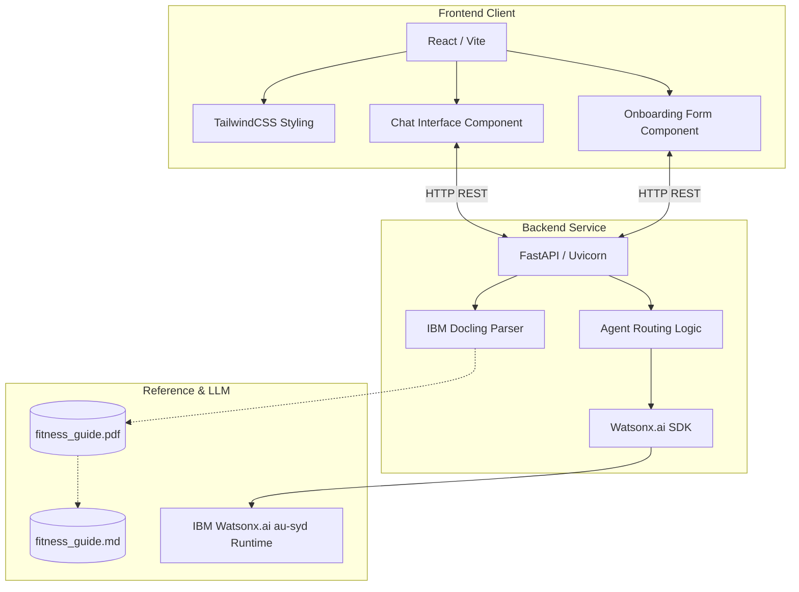

# Fitness Buddy: Agentic AI Health & Fitness Coach

Fitness Buddy is a personalized, state-of-the-art AI-driven fitness and nutrition assistant. It leverages a structured multi-agent routing system, real-time user profile personalization, and document-grounded RAG (Retrieval-Augmented Generation) to deliver tailor-made workout routines, recipe guides, and motivational boosts.

---

## 🌟 Key Features

*   **Tailored Onboarding:** Collects user fitness level, fitness goals, physical limitations/injuries, and dietary preferences to create a persistent profile.
*   **Intelligent Agentic Router:** Automatically classifies user messages into specialized intents:
    *   `WORKOUT`: Custom, injury-aware home workouts.
    *   `NUTRITION`: Diet-aligned meals, macro recommendations, and hydration tips.
    *   `MOTIVATION`: Empathetic and punchy motivational boosts.
*   **Dynamic RAG (Retrieval-Augmented Generation):** Parses and references the local guide (`fitness_guide.pdf`) to ensure coach answers are grounded in validated fitness principles.
*   **Sydney Region Watsonx.ai Integration:** Uses IBM's `granite-8b-code-instruct` language model hosted on the Sydney (`au-syd`) endpoint.

---

## 🛠️ System Architecture & Tech Stack



### Technology Breakdown
1.  **Frontend:** React (Vite), TailwindCSS, custom UI components.
2.  **Backend:** FastAPI, Python, Uvicorn server, Pydantic data schemas.
3.  **Document Parsing & RAG:** **IBM Docling** (converting PDF layouts to Markdown cache).
4.  **Generative AI:** **IBM Watsonx.ai SDK** (`ibm/granite-8b-code-instruct`).

---

## 💡 Key Learnings & Takeaways

### 1. Document Extraction with IBM Docling
*   **Structure Preservation:** Traditional text parsers scramble columns and break tables. Docling preserves layout hierarchy, converting complex elements into clean Markdown headers and lists.
*   **Startup Cache Loading:** Implemented a caching mechanism to avoid re-parsing the source PDF on every backend restart, reducing API startup time to milliseconds.

### 2. Multi-Agent Prompt Routing
*   Rather than sending raw queries to a single generic prompt, we built a classifier to route intents (`WORKOUT`, `NUTRITION`, `MOTIVATION`) to specialized personas.
*   This approach improves model precision, safety handling (e.g. injury avoidance), and response structure.

### 3. IBM Watsonx.ai API Configuration
*   Learned the significance of region endpoints (`au-syd` for Sydney) and their corresponding URL endpoints (`https://au-syd.ml.cloud.ibm.com`).
*   Configured **Watson Machine Learning (WML)** instance mapping, ensuring target project environments are associated with active runtime instances.

---

## 🚀 How to Run the Project

### Prerequisites
*   Python 3.10+
*   Node.js & npm
*   IBM Cloud Watsonx.ai Account

### 1. Backend Setup
1.  Navigate to the backend directory:
    ```bash
    cd backend
    ```
2.  Create and activate a virtual environment:
    ```bash
    python -m venv venv
    .\venv\Scripts\activate
    ```
3.  Install dependencies:
    ```bash
    pip install -r requirements.txt
    ```
4.  Configure the environment variables in a `.env` file inside `backend/`:
    ```ini
    WATSONX_APIKEY=your_ibm_cloud_api_key
    WATSONX_PROJECT_ID=your_watsonx_project_id
    WATSONX_URL=https://au-syd.ml.cloud.ibm.com
    WATSONX_MODEL_ID=ibm/granite-8b-code-instruct
    ```
5.  Start the FastAPI server:
    ```bash
    uvicorn app.main:app --reload --port 8000
    ```

### 2. Frontend Setup
1.  Navigate to the frontend directory:
    ```bash
    cd ../frontend
    ```
2.  Install dependencies:
    ```bash
    npm install
    ```
3.  Start the React app locally:
    ```bash
    npm run dev
    ```
4.  Open the URL (typically `http://localhost:5173`) in your browser to interact with the application.
